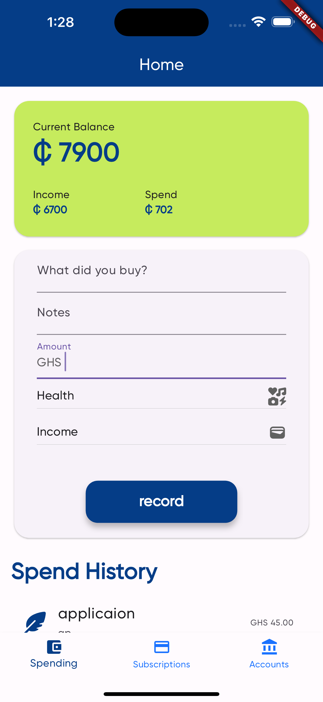
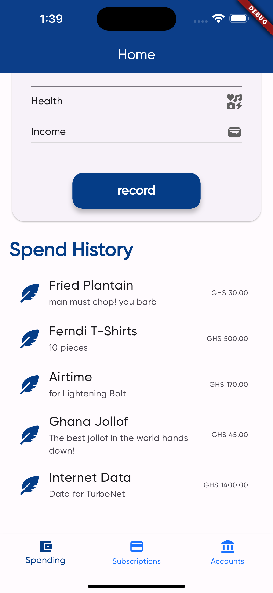
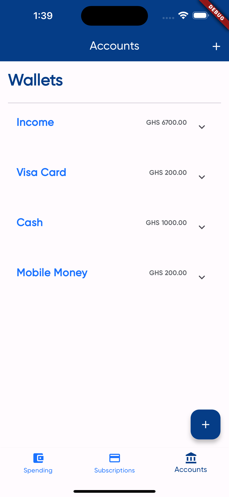
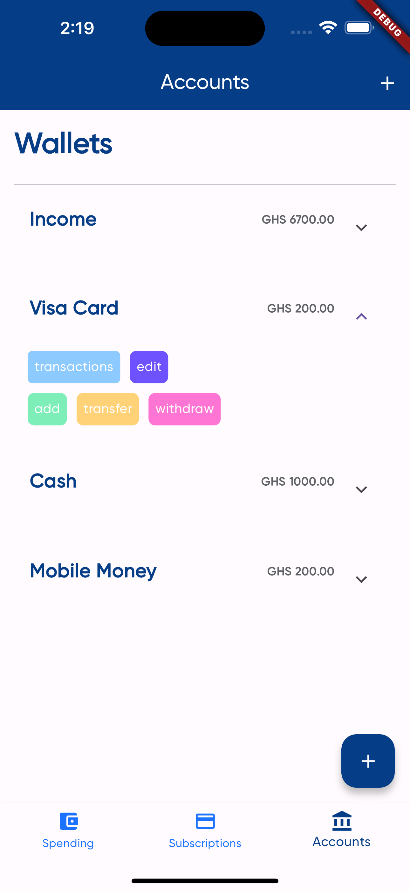

# Ferndi

An opinionated way to manage your wealth. 

## About
An opinionated way to manage your money. 
An app that helps users to track their Spends, Budget their money and track subscriptions.

## Motivation
Over the past years I have tried a lot of budgeting apps unfortunately
none worked for me. I am not saying they were terrible apps but
they didn't resonate with my philosophy managing money.

So I set up to create an app for myself. I have played with the Idea for a while
always saying one day I will build it.

On 1st June, I asked myself if I could build a mobile app within 3 weeks,
It was a challenge that I gladly accepted and this is the reply.

1st June - 7th June I learned Dart (https://github.com/rasheedmhd/codes/tree/main/dart)
8th June - 14th June I learned Flutter 
I started working on this app on the 15th.

## Language

### Showcase

## Home 
Open the app
Type your Spend details
Click Record, as Easy as 1 2 3
  

## Spend History
  

## Subscriptions
Track your Subscriptions and make informed decisions on your recurring expenditure
  

## Accounts
A Single page to manage your
Wallets, 
Savings, [ under construction ]
Categories [ under construction ]
  
  
